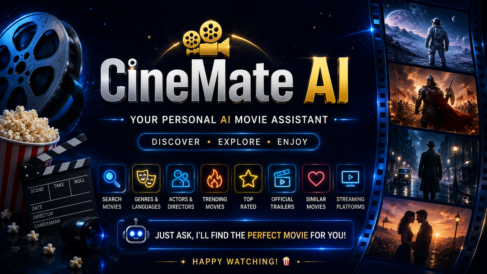
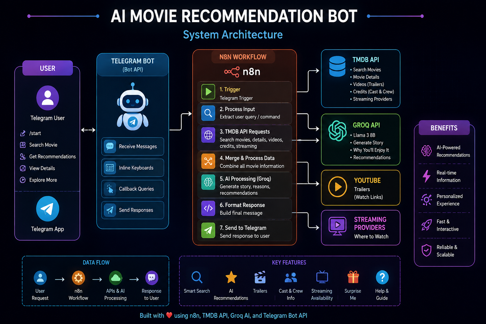
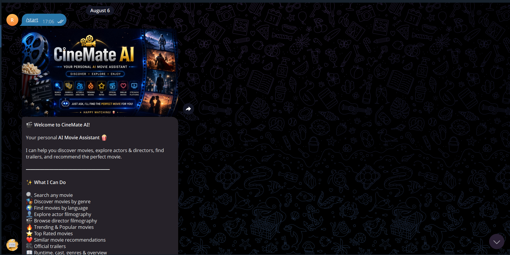
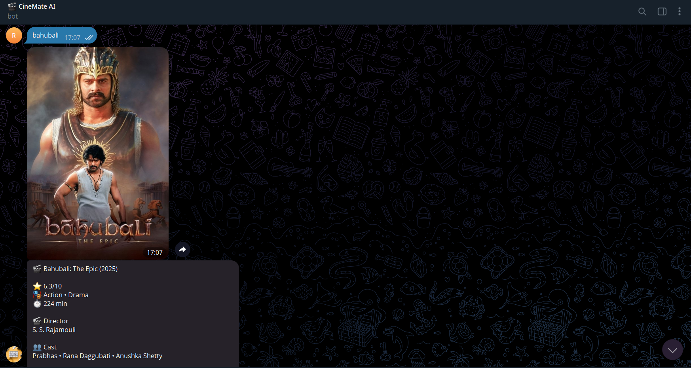
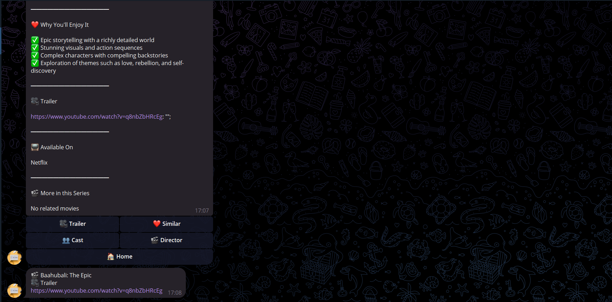
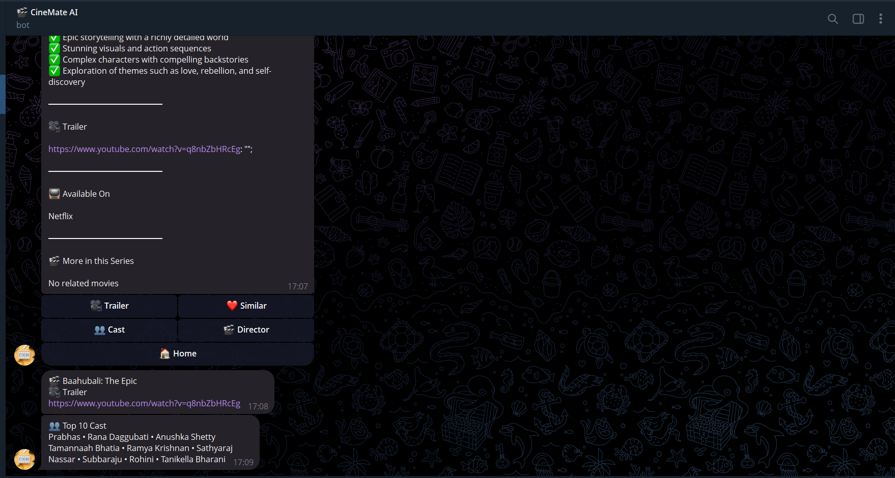
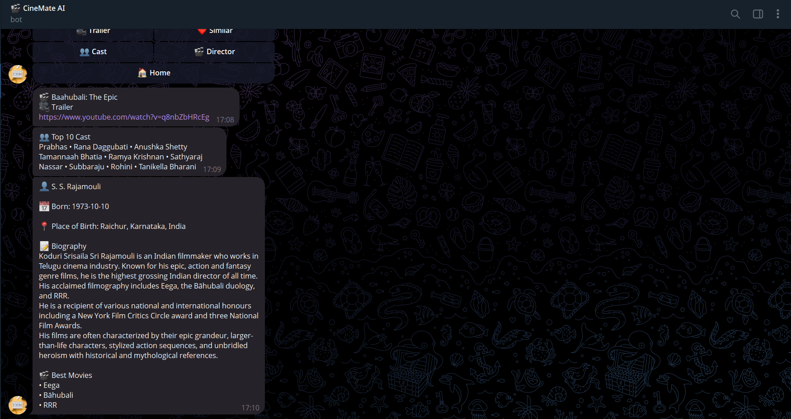
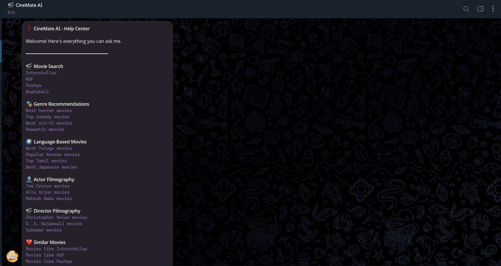

<div align="center">

# 🎬 AI Movie Recommendation Bot

### Your Personal AI Movie Assistant powered by n8n, TMDB API & Groq AI




</div>

---

# 📌 Overview

AI Movie Recommendation Bot is an intelligent Telegram bot built entirely with **n8n** that helps users discover movies using natural language.

The bot combines **TMDB API** for real-time movie data and **Groq AI (Llama 3)** for generating engaging movie summaries and personalized recommendations.

Users can search movies, explore actors and directors, watch trailers, discover trending movies, browse by genre or language, and receive AI-powered movie suggestions—all within Telegram.

---

# ✨ Features

## 🔍 Movie Search

- Search any movie instantly
- AI-generated story summary
- Movie rating
- Runtime
- Genres
- Cast
- Director
- Streaming availability
- Official trailer
- Similar movies

---

## 🎭 Browse by Genre

- Action
- Adventure
- Comedy
- Drama
- Horror
- Romance
- Thriller
- Sci-Fi
- Fantasy
- Animation
- Crime
- Family
- Mystery

---

## 🌍 Browse by Language

- English
- Telugu
- Hindi
- Tamil
- Korean
- Japanese
- French
- Spanish

---

## 🔥 Movie Discovery

- Trending Movies
- Popular Movies
- Top Rated Movies
- Surprise Me

---

## 👥 Explore People

- Actor Filmography
- Director Filmography
- Actor Photos
- Director Photos

---

## 🎥 Movie Information

- Story
- Rating
- Runtime
- Cast
- Director
- Genres
- Trailer
- Streaming Platforms
- Similar Movies

---

## 🤖 AI Features

- AI-generated story summary
- Why you'll enjoy the movie
- Intelligent recommendations
- Natural language interaction

---

# 🏗️ System Architecture

<p align="center">

</p>

---

# ⚙️ Tech Stack

| Technology | Purpose |
|------------|---------|
| n8n | Workflow Automation |
| Telegram Bot API | User Interface |
| TMDB API | Movie Database |
| Groq AI (Llama 3) | AI Content Generation |
| JavaScript | Data Processing |
| HTTP Request | API Communication |

---

# 🔄 Workflow

```
Telegram User
      │
      ▼
Telegram Trigger
      │
      ▼
Intent Detection
      │
      ▼
Switch Node
      │
      ├──────── Search Movie
      ├──────── Trending
      ├──────── Popular
      ├──────── Top Rated
      ├──────── Genres
      ├──────── Languages
      ├──────── Director
      ├──────── Actor
      └──────── Surprise Me
                │
                ▼
          TMDB API
                │
                ▼
       Movie Processing
                │
                ▼
            Groq AI
                │
                ▼
       Build Final Response
                │
                ▼
      Telegram Response
```

---

# 📸 Screenshots

## Welcome Screen



---

## Movie Search



---

## Trailer



---

## Cast



---

## Director



---

## Help



---

# 📂 Project Structure

```
ai-movie-recommendation-bot
│
├── assets
│   ├── banner.png
│   └── architecture.png
│
├── screenshots
│   ├── start.png
│   ├── search.png
│   ├── trailer.png
│   ├── cast.png
│   ├── director.png
│   ├── help.png
│   └── workflow.png
│
├── workflow
│   └── movie-recommendation-bot.json
│
├── README.md
├── LICENSE
└── .gitignore
```

---

# 🚀 Installation

## Clone Repository

```bash
git clone https://github.com/YOUR_USERNAME/ai-movie-recommendation-bot.git
```

---

## Import Workflow

Open n8n

Import

```
workflow/movie-recommendation-bot.json
```

---

## Configure Credentials

Add the following credentials:

- Telegram Bot Token
- TMDB API Key
- Groq API Key

---

## Activate Workflow

Enable the workflow.

Start chatting with your Telegram bot.

---

# 💬 Example Queries

```
Interstellar

Movies like KGF

Christopher Nolan movies

Tom Cruise movies

Trending movies

Top Rated movies

Action movies

Telugu movies

Trailer of Pushpa

Best Sci-Fi movies
```

---

# 🚀 Future Improvements

- Movie watchlist
- User preferences
- Personalized recommendations
- Multi-language responses
- OTT filtering
- Movie collections
- TV Show support
- IMDb integration
- User ratings
- AI chat mode

---

# 🤝 Contributing

Contributions are welcome.

Feel free to open an issue or submit a pull request.

---

# ⭐ Support

If you found this project helpful, please consider giving it a ⭐ on GitHub.

---

# 👨‍💻 Developer

**Chaitanya Ramisetti**

AI Automation & Backend Developer

### Connect

- GitHub
- LinkedIn

---

<div align="center">

## 🎬 CineMate AI

### Discover • Explore • Enjoy

Made with ❤️ using **n8n**, **TMDB API**, **Groq AI**, and **Telegram Bot API**

</div>
